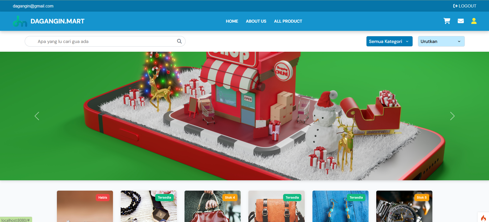
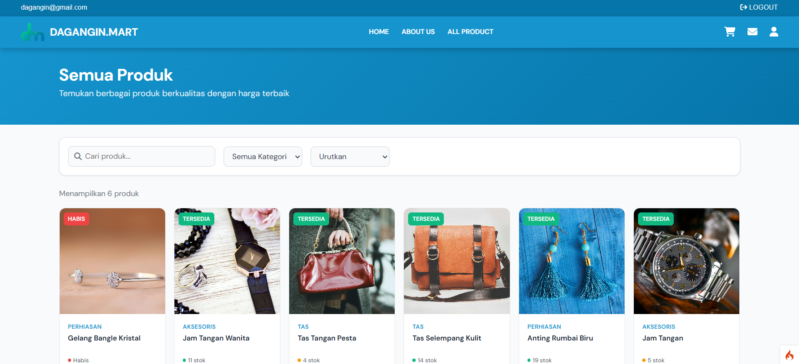
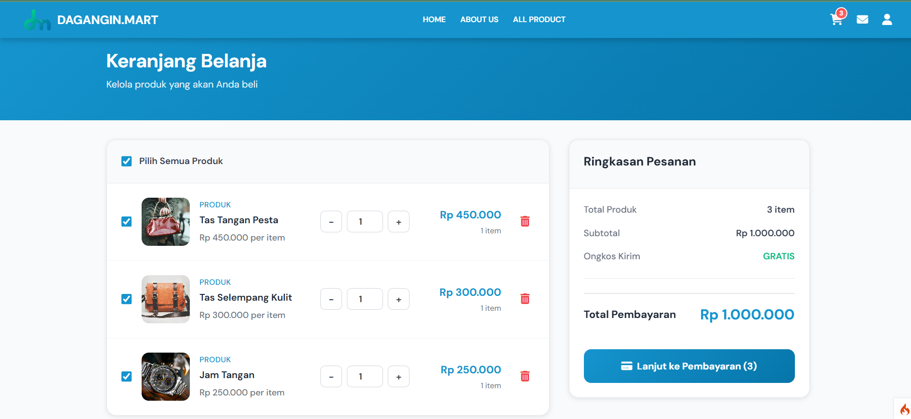

# 🛒 Dagangin Mart 2

**Dagangin Mart 2** adalah aplikasi e-commerce sederhana berbasis web yang dikembangkan menggunakan PHP (kemungkinan framework CodeIgniter). Sistem ini memungkinkan pengguna untuk menjelajah produk, memfilter berdasarkan kategori, dan melihat detail produk.

## 🚀 Fitur Utama

- 🔍 Pencarian dan filter produk berdasarkan kategori dan urutan
- 🗂️ Manajemen kategori produk
- 🖼️ Preview produk dan detail
- ✅ Checkout sederhana
- 👨‍💼 Halaman admin dan user terpisah
- 📦 Integrasi tampilan halaman dinamis

## 🧱 Teknologi yang Digunakan

- PHP
- CodeIgniter4
- JavaScript
- HTML + CSS
- Visual Studio Code

## 📂 Struktur Folder


## 📸 Preview Tampilan

Berikut adalah beberapa tangkapan layar dari antarmuka pengguna:

### 🔹 Halaman Beranda


### 🔹 Halaman Produk


### 🔹 Halaman Detail Produk


## ⚙️ Cara Menjalankan

1. Clone repositori ini:

   ```bash
   git clone https://github.com/username/dagangin-mart2.git


